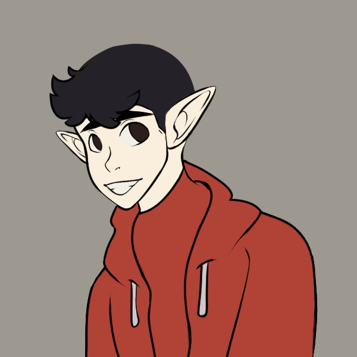

### Olá, eu sou o Felipe Oliveira 🖥️

- 🔭 Trabalhando como Analista de Suporte Bilingue Pleno 
- 🌱 Estudando Bacharelado em Sistemas de Informação e "Escola do Front-End" na Alura (cursos voltados ao Front-End)
- 👯 Buscando uma oportunidade de estágio em programação Front-End
- 😄 Pronouns: Ele/Dele

 
   
   
  
  

  
  
  

